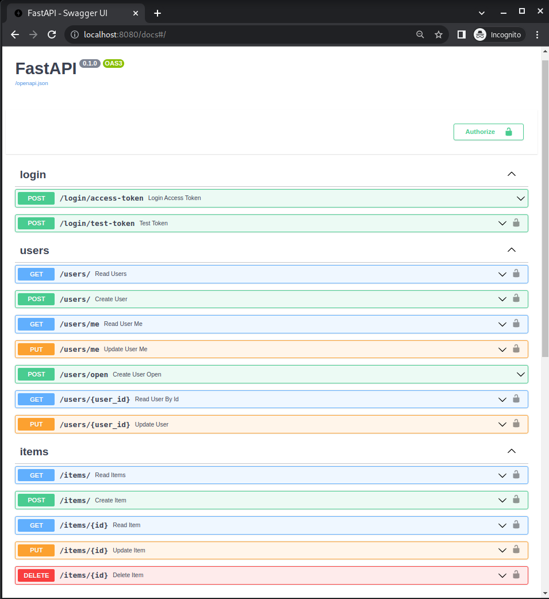

# fastapi_project_template
RESTful Back-end project template with FastAPI + PostgreSQL + JWT + Docker


## Features
- Docker with [FastAPI](https://fastapi.tiangolo.com/) and [PostgresSQL](https://www.postgresql.org/).
- Authentication and securing `Item` routes with [JWT tokens](https://jwt.io/)
- Fastapi which means an interactive API documentation.
- Scalable and evolutive structure for large projects.

Built on Python: 3.8.

## Routes


## File Structure
```
.
├── app
│   ├── Dockerfile
│   ├── main.py
│   ├── requirements.txt
│   ├── .env
│   └── src
│       ├── api
│           ├── endpoints
│               ├── items.py
│               ├── user.py
│               └── login.py
│           ├── api.py
│           └── deps.py
│       ├── core
│           ├── config.py
│           └── security.py
│       ├── crud
│           ├── base.py
│           ├── crud_user.py
│           └── crud_item.py
│       ├── db
│           ├── base_class.py
│           ├── base.py
│           ├── init_db.py
│           └── session.py
│       ├── models
│           ├── item.py
│           └── user.py
│       └── schemas
│           ├── item.py
│           ├── msg.py
│           ├── token.py
│           └── user.py
└── docker-compose.yml
```

## Installation and usage
- clone the repository
```bash
git clone git@github.com:m0kr4n3/fastapi_projetct_template.git
cd fastapi_projetct_template/app/
```
1) Using python
- use `venv` virtual environment
```bash
pip install venv
python -m venv venv
source $PWD/venv/bin/activate
```
- Install dependencies
```bash
pip install -r requirements.txt
```
- Create env from env template:
```bash
cp example.env .env #only once
```
- Put there the necessary info
- Run main.py
```bash
python main.py
```
2) Using docker
Install docker-compose if it's not  done already
```bash
sudo apt install docker-compose
```
- Run docker-compose in the repo root directory :
```bash
sudo docker-compose up
```

#### Inspired from [Full Stack FastAPI and PostgreSQL - Base Project Generator](https://github.com/tiangolo/full-stack-fastapi-postgresql)
